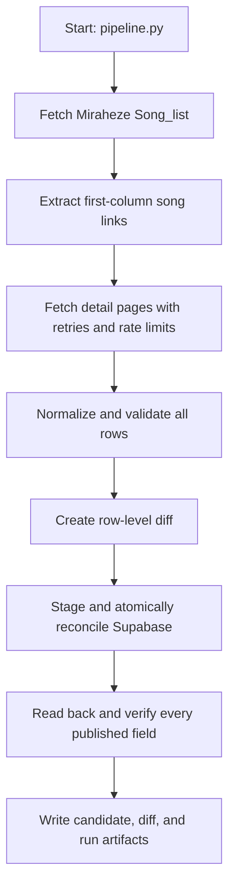

# Arcaea Charts (Miraheze) Data

The pipeline discovers every song link in the first column of Miraheze's
`Song_list`, fetches each linked page through the MediaWiki API, and extracts
artist, difficulty, level, constant, version, and charter metadata. The visible
chart fields are authoritative: levels retain a `+`, difficulty labels take
precedence over CSS classes, and constants are parsed with `Decimal`. It
supports Future, Eternal, Beyond, and Inscribed difficulties.

## Pipeline (Scrape → Supabase)

One command to scrape the catalog and publish validated metadata rows into the
Supabase `songs` table:

```bash
python pipeline.py
```



Requires `SUPABASE_URL` and `SUPABASE_SERVICE_ROLE_KEY` in the environment or in `.env`.

Apply migrations `001_add_charter_column.sql`,
`002_reliable_song_sync.sql`, and `003_source_fidelity.sql` in order before the
first production publish. A complete crawl reconciles stale rows in the same database function;
an incomplete crawl only upserts rows and leaves stale data untouched. Inscribed
replaces Beyond for the same song only during a complete reconciliation.

Every run writes a JSON snapshot plus complete candidate and row-level diff
artifacts under `snapshots/`, including failed runs. A publish is not marked
successful until a database read-back matches the candidate; verification
mismatches include the key, source value, and stored value.

## GitHub Actions (automated sync)

The pipeline can run on a schedule or on demand via GitHub Actions. The workflow uses the **PROD** environment.

- **Triggers:** Daily at 4:00 UTC (cron) and manual run from the Actions tab (`workflow_dispatch`).
- **PROD environment:** In **Settings → Secrets and variables → Actions**, open **Environments** and select **PROD**. Then:
  - **Variables:** `SUPABASE_URL`, `SUPABASE_SERVICE_ROLE_KEY`.

Do not commit `.env`; the workflow uses these secrets as environment variables. After pushing the workflow file (`.github/workflows/sync-songs.yml`) and setting secrets, run the “Sync songs to Supabase” workflow once manually from the Actions tab to verify.

## Development and linting

- **Lint:** Run `pylint scraper.py pipeline.py`. The project uses [.pylintrc](.pylintrc) (e.g. `max-line-length=120`). Fix all errors and warnings before committing.
- **CI:** The [Lint](.github/workflows/lint.yml) workflow runs pylint on every push and pull request. The [Sync songs to Supabase](.github/workflows/sync-songs.yml) workflow also runs pylint before the pipeline so scheduled and manual syncs fail fast if the code doesn’t pass lint.
- **Tests:** Run `python -m unittest discover -s tests` from `data-pipeline`.
- **Pre-commit (optional):** To run pylint automatically before each commit, install [pre-commit](https://pre-commit.com/) and add a local hook that runs the pylint command above.
- **AI / agents:** The repo includes [.cursor/rules/lint-and-style.mdc](.cursor/rules/lint-and-style.mdc) so Cursor (and similar tools that read project rules) are instructed to run pylint and follow the project’s style when editing Python.
