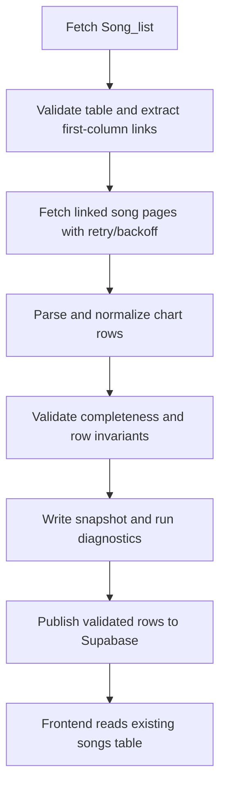

# Reliable Miraheze Song Pipeline

## Goal

Replace the current Fandom `Songs_by_Level` scrape with a reliable sync from
the [Miraheze Song list](https://arcaea.miraheze.org/wiki/Song_list).

`Inscribed` difficulty support and related frontend changes are specified in
[`2026-09-07-inscribed-difficulty-filter-design.md`](2026-09-07-inscribed-difficulty-filter-design.md)
and are included in this migration's implementation scope.

The sync must discover the complete catalog from the song links in the first
column of the source table, fetch the linked song pages for chart metadata, and
publish only a validated dataset. A transient wiki failure or markup change
must not result in an empty or partial catalog replacing the last good data.

## Existing Behavior and Problems

- `data-pipeline/scraper.py` uses the Fandom MediaWiki API and parses
  `Songs_by_Level` as a fixed six-column table.
- The current chart parser and pipeline only recognize Future, Eternal, and
  Beyond, so they must be extended to accept Inscribed.
- The current News-section fallback is not a complete catalog source and can
  silently miss songs that are not mentioned in News.
- Network requests have a timeout but no retry, backoff, rate limiting,
  response validation, or persistent scrape diagnostics.
- A successful request that returns changed or incomplete HTML can still
  produce a partial result and proceed to upsert it.
- `songs.difficulty` is already a text value and the `Song`/`SongSummary`
  TypeScript fields are already generic strings. No schema type change is
  required for Inscribed.

## Source Contract

### Catalog page

The canonical discovery URL is:

```text
https://arcaea.miraheze.org/wiki/Song_list
```

The scraper will request the parsed HTML through the Miraheze MediaWiki API:

```text
https://arcaea.miraheze.org/w/api.php
```

The catalog parser must:

1. Select the song-list data table by its header names, not by a positional
   `table` selector alone.
2. Identify the `Song` header and use only the link in the first cell of each
   data row as the discovery link.
3. Ignore navigation, language, pack, and unrelated links elsewhere on the
   page.
4. Resolve relative links against the Miraheze origin and decode the MediaWiki
   page title from the URL.
5. Deduplicate links by normalized page title while retaining the first
   display title and canonical URL.
6. Capture the catalog-level fields that are present and useful for validation,
   especially artist, level columns, version, and pack. The detail-page data
   remains authoritative for chart rows and constants.

The parser must not assume that the number or order of difficulty columns will
remain fixed. Header matching should accept the existing difficulty
abbreviations present in the source, including `INS`, and preserve canonical
mappings.

### Song detail pages

Each discovered song link is fetched from Miraheze and parsed into zero or more
rows with this normalized shape:

```text
title, artist, difficulty, chart_constant, level, version, charter
```

The detail parser should read the page's chart tables and map the wiki's
difficulty labels to canonical values:

| Wiki label | Stored value |
|------------|--------------|
| `PST` | `Past` |
| `PRS` | `Present` |
| `FTR` | `Future` |
| `ETR` | `Eternal` |
| `BYD` | `Beyond` |
| `INS` | `Inscribed` |

The first release publishes Future, Eternal, Beyond, and Inscribed. Past and
Present may be parsed for diagnostics but remain excluded from the `songs`
table.

Difficulty text rendered in the chart-information cells is authoritative. The
parser must check the visible label, such as `[Inscribed]`, before consulting a
CSS class. Miraheze may reuse an existing class such as `byd-txt` for a new
difficulty, so CSS classes alone must not determine the stored difficulty.
Keep class-key mappings as a fallback configuration rather than scattering
`ins` assumptions through the parser.

## Pipeline Architecture

Refactor the pipeline into explicit stages. Each stage returns structured data
and counts so failures are visible and testable.



### 1. Fetch and extract catalog links

Add a Miraheze source configuration and replace the Fandom-specific constants.
The catalog fetch must record the page revision ID when returned by the API, the
fetch timestamp, and the source URL.

Use a single `requests.Session` with:

- connect and read timeouts rather than one unbounded timeout;
- retries for connection errors, HTTP 429, and transient 5xx responses;
- exponential backoff with jitter and support for `Retry-After`;
- a modest delay between detail-page requests;
- a descriptive User-Agent identifying the project and repository.

If the catalog request fails, has no expected table, has no song links, or falls
below a configured minimum link count, abort the run before touching Supabase.
The minimum should be based on an observed baseline rather than a fragile fixed
song count; the validator should fail on a large relative drop from the last
successful snapshot as well.

### 2. Fetch detail pages

Fetch each unique song page with bounded retries. A failed page is recorded with
its URL, page title, HTTP/error class, and retry count. It must not terminate
the entire crawl immediately, but the run must fail the publish gate when the
failure ratio exceeds the configured threshold (initial proposal: 5%) or when
any newly discovered page cannot be parsed into a valid song record.

Do not use an unbounded concurrent worker pool. Start with sequential requests
or a small bounded pool after confirming Miraheze's acceptable request rate.
This avoids rate-limit bursts and makes failures reproducible.

### 3. Normalize and validate rows

Normalization rules:

- Trim whitespace and normalize repeated internal whitespace for titles,
  artists, difficulty labels, levels, and versions.
- Preserve display casing and Unicode in titles, artists, and charter names.
- Convert chart constants to finite decimal numbers; reject placeholders,
  ranges, and non-numeric values rather than guessing.
- Parse the leading numeric portion of levels (`9+` becomes `9`) using the
- preserve an explicit `+` level marker and derive one when the constant is in
  the `.7` through `.9` range (`8.8 -> 8+`, `11.8 -> 11+`).
- Use the canonical difficulty names above for all database rows.
- Deduplicate by `(title, artist, difficulty)` before publish, with duplicate
  conflicting values treated as a validation error instead of silently choosing
  one row.

Required row invariants:

- title, artist, difficulty, level, and version are present when the source
  provides them;
- difficulty is one of Future, Eternal, Beyond, or Inscribed;
- constant is finite and within the existing accepted range (`<= 13`);
- a chart row has a valid level and constant together;
- difficulty values are never silently renamed or merged during normalization.
- when a song has both Inscribed and Beyond rows, publish Inscribed and remove
  the replaced Beyond row for that song.

Charter enrichment remains best-effort. A missing charter does not fail the
run, but charter fetch/parse errors must be counted and logged.

### 4. Snapshot and publish gate

Write a machine-readable snapshot artifact for every attempted crawl, including:

- source URL and revision ID;
- fetch timestamp;
- discovered link count and unique link count;
- successful, failed, and skipped detail pages;
- row counts by difficulty;
- validation errors and warnings;
- a deterministic hash of the normalized publish dataset.

Store the artifact as a CI artifact and retain the last successful snapshot for
comparison. A run may publish only when all of these checks pass:

- catalog table and expected `Song` header are present;
- unique link count is non-zero and does not drop beyond the configured
  baseline threshold;
- detail-page failure ratio is below the threshold;
- the normalized dataset contains rows for the expected existing difficulties;
- every row passes the invariants;
- the dataset is not unexpectedly empty or dramatically smaller than the last
  successful run.

If validation fails, exit non-zero and leave the existing Supabase catalog
unchanged. The previous behavior of continuing with whatever rows happened to
parse is explicitly removed.

### 5. Safe Supabase publication

Use a staging table or staging run identifier for a validated dataset, then
publish it in one database transaction/RPC. The publish operation should:

1. Insert the complete validated row set into staging.
2. Upsert to `songs` using the existing conflict key
   `(title, artist, difficulty)`.
3. Mark the run successful with its dataset hash and counts.
4. Only after a successful full publish, optionally remove rows known to be
   retired by the source.

The first migration should not delete rows merely because a detail request
failed. Stale-row deletion must require a complete catalog crawl and an
explicit source reconciliation flag. This protects existing data during source
outages and markup transitions.

Add a small `song_sync_runs` table, or equivalent durable run metadata, with
status, source revision, counts, dataset hash, error summary, and timestamps.
The staging/run tables are operational metadata and are not exposed through the
frontend's public read path.

The existing `songs` columns and conflict key remain compatible; only the
operational staging/run migration is new.

## Frontend and API Changes

The detailed filter behavior is specified in
[`2026-09-07-inscribed-difficulty-filter-design.md`](2026-09-07-inscribed-difficulty-filter-design.md).
This migration must implement its frontend requirements:

- Add `Inscribed` to `difficultyTypes` and map it to `#030E46` in
  `src/lib/song-utils.ts`.
- Render `INS` for the Inscribed filter button in `src/pages/Index.tsx`.
- Preserve existing selection, OR filtering, pagination reset, and responsive
  behavior.
- Update `api/video-utils.mjs` and the Vite development middleware so Chart
  View recognizes both `Inscribed` and `INS` search terms.
- Keep Supabase queries, local-storage cache shape, and TypeScript song types
  unchanged.

### Documentation

Update the root and data-pipeline READMEs to document:

- Miraheze as the source of truth;
- first-column link discovery followed by detail-page parsing;
- supported difficulties including Inscribed and source migration behavior;
- validation failure behavior and snapshot artifacts;
- required Supabase credentials and any sync-run migration setup.

## Files To Change

| File | Change |
|------|--------|
| `data-pipeline/scraper.py` | Refactor into Miraheze catalog-link extraction, detail-page parsing, normalization, retries, and diagnostics. |
| `data-pipeline/pipeline.py` | Add validation gate, snapshot output, and safe publish orchestration. |
| `data-pipeline/supabase/migrations/002_reliable_song_sync.sql` | Add staging/run metadata and an atomic publish function, if required by implementation. |
| `data-pipeline/requirements.txt` | Add only dependencies required by the refactor; prefer the existing requests/BeautifulSoup stack. |
| `.github/workflows/sync-songs.yml` | Upload snapshots, preserve non-zero failure status, and configure retention. |
| `src/lib/song-utils.ts` | Add Inscribed to the filter list and color map. |
| `src/pages/Index.tsx` | Render the `INS` filter label. |
| `api/video-utils.mjs` | Add Inscribed/INS search and relevance terms. |
| `vite.config.ts` | Keep development API behavior aligned with production. |
| `README.md` | Document the new source and supported difficulties. |
| `data-pipeline/README.md` | Document reliability checks, snapshots, and supported difficulties. |

## Testing Strategy

### Parser fixtures

Commit sanitized HTML fixtures for:

- the current Miraheze `Song_list` table;
- a row with a normal song link in the first column;
- navigation/pack links that must not be treated as songs;
- a song page containing Future, Eternal, Beyond, and Inscribed;
- alternate/missing constants and malformed chart cells;
- duplicate links and duplicate conflicting chart rows.

Unit tests must assert the exact normalized row shape, canonical difficulty
names, link counts, and validation failures.

### Failure and integration tests

Test retries for 429/5xx, timeout handling, `Retry-After`, and a permanently
failed detail page. Verify that a failed run produces a non-zero exit status,
snapshot diagnostics, and no Supabase publish.

Run an integration sync against a captured fixture or a controlled test
Supabase project and verify:

- all discovered first-column song links are represented when their detail
  pages are valid;
- an Inscribed row has the expected artist, level, constant, version, and
  canonical difficulty;
- duplicate rows collapse deterministically;
- a second run is idempotent;
- a partial crawl cannot delete or overwrite the last good catalog.

### Frontend verification

Run `npm run lint` and `npm run build`. Manually verify at desktop and mobile
widths that `INS` is visible and keyboard-focusable, selected Inscribed uses
`#030E46` with white text, Inscribed-only and combined filters work, pagination
resets after selection changes, and Chart View uses Inscribed search terms.

## Rollout and Recovery

1. Implement and test the parser against committed fixtures before changing the
   production source.
2. Run Miraheze in dry-run mode and compare link, row, and per-difficulty
   counts with the current Supabase catalog.
3. Apply the operational migration and run a validated staging publish without
   destructive reconciliation.
4. Confirm Inscribed rows and frontend filtering in production.
5. Enable the scheduled workflow after one successful manual run.

If Miraheze changes its markup or becomes unavailable, the workflow must fail
closed. Keep the last successful `songs` data available and use the snapshot
error summary to update the parser. Recovery consists of fixing the parser,
rerunning fixture tests, and replaying the sync; no manual deletion is needed.

## Risks and Decisions

- **Markup drift:** Select by semantic headers and validate the page shape;
  do not rely on fixed table positions or an unverified `ins` class name.
- **Source completeness:** First-column links are the catalog authority. The
  News-section fallback is removed as a source of truth, though it may remain
  as a separate diagnostic if useful.
- **Rate limiting:** Bounded requests, retries, and backoff are preferred over
  aggressive parallel scraping.
- **Partial data:** Failed detail pages are retained in diagnostics and block
  publication above the threshold. Existing production data is never replaced
  by a partial crawl.
- **Retired songs:** Do not delete on absence by default. Add deletion only to a
  later, explicitly enabled reconciliation step after full-crawl confidence is
  established.
- **Cache freshness:** Existing browser caches may delay visibility of refreshed
  rows for up to 24 hours. The cache schema is unchanged, so no cache key
  migration is necessary.
