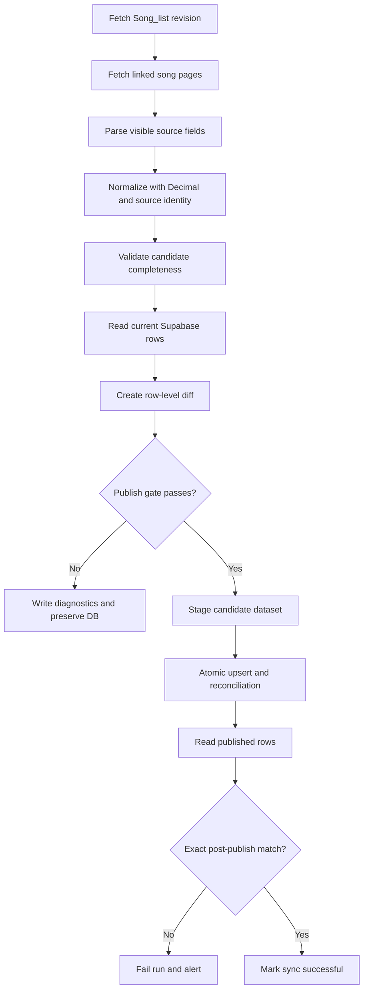

# Source Fidelity and Database Reconciliation

## Goal

Make the Miraheze wiki the verifiable source of truth for every published song
chart row. The pipeline must preserve the values shown on the wiki, detect
source or parser drift before publishing, and prove that Supabase matches the
validated source dataset afterward.

This design builds on
[`2026-09-07-song-pipeline-reliability-design.md`](2026-09-07-song-pipeline-reliability-design.md)
and covers the specific data-fidelity gaps found while importing Inscribed
charts and level-plus values.

## Problems to Eliminate

- Level text such as `10+` is reduced to `10` and reconstructed indirectly.
- Binary floating-point comparisons can misclassify exact boundaries such as
  `8.7`, `9.7`, and `10.7`.
- CSS classes can be stale or reused. For example, an `[Inscribed]` cell may
  still have a `byd-txt` class.
- Chart-designer cells can span multiple difficulty columns and require column
  expansion before indexing.
- Existing rows can remain in Supabase after the source changes because an
  upsert alone does not reconcile deletions or replacements.
- Aggregate counts and a dataset hash do not identify which individual row
  differs from the source.
- A successful write is not currently followed by a complete read-back
  comparison against the candidate dataset.

## Source Fidelity Rules

### Authoritative fields

For each linked Miraheze song page, the visible chart-information fields are
authoritative:

```text
title, artist, difficulty, level, constant, version, charter
```

The parser must preserve the source value before normalization. Normalization
may trim whitespace, decode HTML entities, and standardize the canonical
difficulty name, but it must not infer a replacement value when the source
provides one.

### Difficulty detection

1. Read the visible cell text first, removing only surrounding brackets and
   whitespace. `[Inscribed]` must always map to `Inscribed`.
2. Use CSS class mappings only as a fallback for cells whose visible text is
   abbreviated or unavailable.
3. Keep mappings for `PST`, `PRS`, `FTR`, `ETR`, `BYD`, and `INS` in one table.
4. Treat a visible label and CSS class disagreement as a diagnostic warning.
   The visible label wins.

### Level detection

Read the level cell as text and preserve a trailing `+`:

```text
8  -> "8"
8+ -> "8+"
10+ -> "10+"
```

Do not derive the stored level from the chart constant when the wiki has a
level value. The constant may be used only as a validation fallback for legacy
or malformed pages.

### Constant detection

Parse chart constants from their source text using `Decimal`, not binary
floating point. Reject placeholders, ranges, non-finite values, and constants
outside the existing accepted range.

The compatibility rule for legacy rows whose source level lacks a plus marker
is:

```text
fractional part .7 through .9 -> base level + "+"
```

Examples:

```text
8.7 -> 8+
9.7 -> 9+
10.7 -> 10+
11.8 -> 11+
```

This rule must use `Decimal("0.7")` and `Decimal("1.0")` boundaries. It must
not replace an explicit source level; it exists to repair legacy rows and to
validate an absent or malformed level only.

### Spanned cells

When a chart-information data cell declares `grid-column: span N`, expand that
cell across N logical difficulty columns before matching levels, constants,
notes, or charters. This is required for pages where one charter covers
Past/Present/Future and another charter is specific to Inscribed.

## Candidate Dataset Model

Introduce an internal normalized row model with explicit source identity:

```text
source_page_title
source_url
source_revision
title
artist
difficulty
level
constant
version
charter
row_hash
```

The database-facing `songs` row remains compatible with the existing schema.
Source identity and hashes are retained in the sync snapshot and run metadata,
not necessarily exposed through the public `songs` query.

The row hash must be deterministic and include all published fields. Sort keys
and serialize with stable JSON settings before hashing.

## Reconciliation Flow



### Pre-publish diff

After a complete candidate crawl, compare normalized candidate rows with the
current `songs` rows by `(title, artist, difficulty)`.

The diff must classify:

- `added`: source row absent from Supabase;
- `changed`: same key but one or more published fields differ;
- `unchanged`: identical row hash;
- `stale`: Supabase row absent from the complete source candidate;
- `replaced`: a source Inscribed row exists for a song where Supabase still has
  the corresponding Beyond row.

A stale or replacement deletion is allowed only when the catalog completeness
gate passes. Any partial crawl leaves stale rows untouched.

### Inscribed replacement policy

For each `(title, artist)` pair:

1. Publish the source Inscribed row.
2. If the source contains Inscribed, do not publish the corresponding Beyond
   row as an active chart row.
3. Delete the existing Beyond row only during a complete successful
   reconciliation.
4. Record the deletion in the run diff and snapshot.

This prevents a song such as `DREAD AREA` from exposing both Beyond and
Inscribed when the source identifies Inscribed as the replacement chart.

### Post-publish verification

After the atomic publish function completes:

1. Read all rows represented by the candidate dataset back from Supabase.
2. Normalize database types into the same comparison representation.
3. Compare row keys and every published field.
4. Verify expected stale/replacement deletions.
5. Compare candidate and database dataset hashes.

Any mismatch marks the run failed and prevents the run from being recorded as
successful. The mismatch report must include the key, source value, and stored
value for each differing field.

## Snapshot and Run Metadata

Extend the sync snapshot with:

- source revision and fetch timestamp;
- complete candidate rows or a compressed row artifact;
- candidate row count and row counts by difficulty;
- candidate dataset hash;
- added, changed, unchanged, stale, replaced, and deleted counts;
- row-level mismatch details;
- post-publish database hash;
- final verification status.

The `song_sync_runs.details` JSON should reference the row artifact and retain
the diff summary. CI must upload both successful and failed artifacts.

## Database Changes

The existing `songs` table remains the public catalog. Add operational metadata
as needed:

- `song_sync_runs` stores run status, source revision, hashes, and diff summary.
- `song_sync_staging` stores one complete candidate dataset per run.
- `publish_song_sync` performs the atomic upsert and complete-crawl cleanup.

If `songs.level` is text, keep it text end-to-end so values such as `10+` are
not lost in staging. If the existing staging table is integer-typed, add a
migration to change only the staging level column to text before publishing
plus levels atomically.

Do not use direct row-by-row writes as the normal publish path. A one-time
repair script may be used for legacy corrections, but future runs must use the
staging transaction and post-publish read-back.

## Implementation Changes

| File | Change |
|------|--------|
| `data-pipeline/scraper.py` | Preserve visible levels, prioritize visible difficulty labels, expand spanned cells, parse source identity, and use Decimal constants. |
| `data-pipeline/pipeline.py` | Build candidate row hashes, produce row-level diffs, reconcile replacements/stale rows, and verify the database after publish. |
| `data-pipeline/supabase/migrations/003_source_fidelity.sql` | Ensure staging levels support `N+` text and add any required source/run metadata. |
| `data-pipeline/README.md` | Document source fidelity, reconciliation, repair behavior, and snapshot artifacts. |
| `.github/workflows/sync-songs.yml` | Upload complete candidate/diff artifacts and fail the workflow on verification mismatch. |
| `docs/superpowers/specs/2026-09-07-song-pipeline-reliability-design.md` | Link to and incorporate the row-level source reconciliation requirements. |
| `docs/superpowers/specs/2026-09-07-inscribed-difficulty-filter-design.md` | Document Inscribed source parsing and Beyond replacement behavior. |

## Validation Gates

Publishing is blocked when:

- the source table or expected headers are missing;
- the link count drops beyond the configured baseline;
- detail-page failures exceed the allowed ratio;
- a supported row has no valid title, artist, level, or constant;
- duplicate rows have conflicting source values without an explicit variant
  policy;
- the candidate dataset unexpectedly loses an existing difficulty;
- post-publish rows differ from the candidate dataset;
- the database hash does not match the candidate hash after reconciliation.

Warnings such as a reused CSS class, a legitimate chart variant, or missing
optional charter data are retained in diagnostics and do not block a run unless
they affect an authoritative published field.

## Tests

### Parser fixtures

Add fixtures for:

- `[Inscribed]` rendered with `byd-txt`;
- explicit levels `8+`, `9+`, and `10+`;
- constants exactly `8.7`, `9.7`, and `10.7`;
- chart-designer cells spanning three columns and one Inscribed column;
- missing or malformed level and constant cells;
- duplicate chart variants such as `Last`;
- a page containing both Beyond and Inscribed.

### Reconciliation tests

Test that the diff correctly identifies added, changed, stale, replaced, and
unchanged rows. Verify that stale and Beyond replacement deletion is blocked
when the crawl is incomplete and allowed only after a complete crawl.

### End-to-end verification

Against a controlled Supabase project, verify that:

- a complete source fixture produces the expected candidate hash;
- publish is idempotent;
- database read-back exactly matches the candidate rows;
- `DREAD AREA` has Inscribed and no active Beyond row;
- all constants in the `.7-.9` range have the expected `N+` level;
- a simulated parser or network failure leaves the last good catalog intact.

## Rollout

1. Add fixtures and exact source parsing before enabling reconciliation deletes.
2. Run in dry-run mode and inspect the complete row-level diff.
3. Apply the staging-level/source metadata migration.
4. Run one manual publish and verify the post-publish hash.
5. Run the legacy repair once for existing level-plus and replaced Beyond rows.
6. Enable scheduled runs only after a successful end-to-end verification.

## Recovery

If source markup changes or post-publish verification fails:

- preserve the last successful catalog;
- keep the failed candidate and diff artifacts;
- disable destructive reconciliation if necessary;
- fix the parser against a captured fixture;
- rerun dry-run and post-publish verification before retrying.
